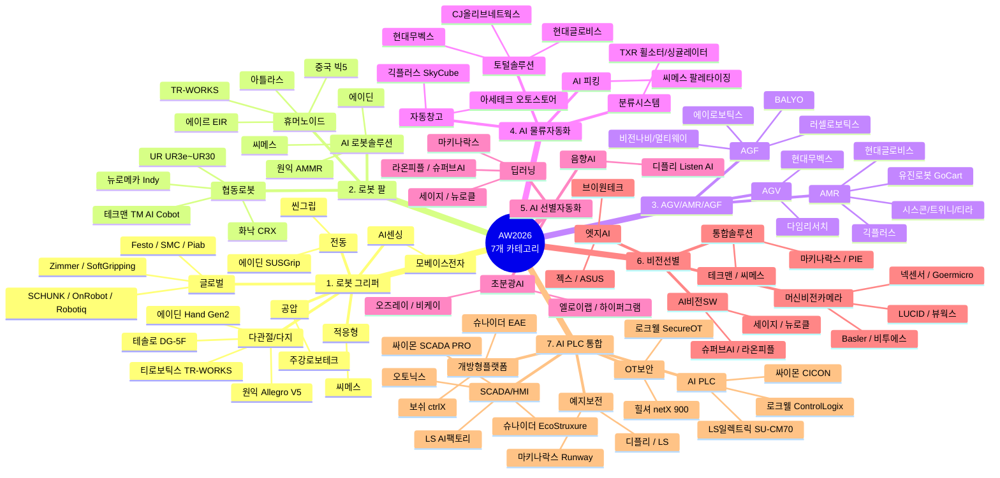

# AW2026 (2026 스마트공장·자동화산업전) 참가업체 심층 조사

> **행사 개요:** 2026년 3월 4~6일 | 서울 코엑스 전관 (A·B·C·D홀) | 24개국 500개 기업, 2,300부스, 약 80,000명
> **슬로건:** "자율화, 지속가능성을 이끄는 힘 (Autonomy, The Driver of Sustainability)"
> **핵심 키워드:** Physical AI, 휴머노이드, 자율제조(AX), AI 팩토리
> **특별관:** 스마트물류 특별관(D홀), AI 팩토리 특별관, Korea Vision Show(B홀)

---

# 1. 로봇 그리퍼 업체 및 대표 기술 (그리퍼 종류별)

## 1-1. 그리퍼 종류별 비교표

| 그리퍼 종류 | 작동 원리 | 가반하중 | 장점 | 단점 | 주요 적용 분야 |
|-------------|-----------|----------|------|------|----------------|
| **공압 그리퍼** | 압축 공기로 피스톤 구동 | 0.1~수백 kg | 구조 단순, 저가, 고파지력, 빠른 사이클 | 위치 제어 2단계, 공압라인 필요, 소음 | 자동차 부품, 금속가공, CNC |
| **전동 그리퍼** | 서보/스테퍼모터 + 볼스크류 | 0.1~20 kg | 위치/속도/힘 정밀 제어, 공압라인 불필요, 저소음 | 초기 비용 높음, 고온환경 제한 | 반도체, 전자부품, 정밀조립 |
| **진공 그리퍼** | 흡착패드 + 진공발생기 음압 형성 | 0.01~50+ kg | 물체 손상 없음, 평평/얇은 물체 최적 | 다공성 소재 불가, 불규칙 표면 누설 | 식품포장, 웨이퍼, 유리, 물류 |
| **자석 그리퍼** | 영구자석/전자석 자기력 흡착 | 0.5~수백 kg | 고온(350°C) 대응, 기름/분진 환경 가능 | 강자성체만 가능, 잔류자기 | 자동차 프레스, 철강, 용접 |
| **소프트 그리퍼** | 실리콘 유연 소재를 공압 팽창 | 0.01~3 kg | 깨지기 쉬운 물체 안전 파지, 형상 적응 | 파지력 낮음, 내구성 제한 | 식품, 제약, 농업 |
| **다관절/다지 그리퍼** | 3~5개 다관절 핑거 개별 모터 제어 | 0.5~5 kg | 인간 수준 정교한 조작, AI 학습 가능 | 매우 고가, 제어 복잡 | 연구, 의료, 휴머노이드 |
| **적응형 그리퍼** | 언더액추에이티드 구조 자동 적응 | 0.2~10 kg | 그리퍼 교체 없이 다품종 대응 | 전용 대비 최적 성능 낮음 | 다품종 소량, 물류 피킹 |
| **니들 그리퍼** | 바늘이 직물/다공성 소재 관통 파지 | 0.05~5 kg | 진공 불가한 다공성 소재 대응 | 소재 미세 구멍 발생 | 의류/섬유, 카펫, 내장재 |
| **툴체인저** | 마스터/슬레이브 커플링 자동 교환 | 1~2,500 kg | 하나의 로봇 다공정 수행, 유연성 극대화 | 추가 비용, 가반하중 차감 | 다공정 자동화, 용접/조립 |

## 1-2. AW2026 참가 확인 그리퍼 업체

### 다관절/다지 그리퍼 (휴머노이드 핸드)

| 업체명 | 국적 | 대표 모델 | 핵심 스펙 | 적용분야 |
|--------|------|-----------|-----------|----------|
| **테솔로 (TESOLLO)** | 한국 | Delto Gripper DG-5F | 20DoF 5지, 무게 1.7kg, 파지력 최대 20kg, 250Hz 제어, 다이렉트 드라이브, 모듈형 | 휴머노이드, 정밀 조작, Pick&Place |
| **테솔로** | 한국 | DG-5F-S (경량형) | 20DoF, 1kg 미만, 고해상도 자기 엔코더 | 경량 휴머노이드, 연구용 |
| **원익로보틱스 (Wonik)** | 한국 | Allegro Hand V5 Sense | 16DoF 4지, 16개 압력감지 센서, 촉각 피드백, ISO 9409-1-A50, CAN/이더넷 | 연구, AI 학습, 정밀 조작 |
| **원익로보틱스** | 한국 | Allegro Hand V5 4F Plus | 16DoF, 기존 3배 가반하중, CE 인증 | 산업용 정밀 파지, 상업용 |
| **티로보틱스 (T-Robotics)** | 한국 | TR-WORKS 로봇 핸드 | 3지/2지 교체형, 산업용 휴머노이드 전용 | 반도체/디스플레이 클린룸 |
| **에이딘로보틱스 (AIDIN)** | 한국 | AIDIN Hand Gen2 | 16DoF 인간형, 촉각센서(ATT), 시간당 1,000개 물류 처리 | 물류, 휴머노이드 |

### 전동 그리퍼

| 업체명 | 국적 | 대표 모델 | 핵심 스펙 | 적용분야 |
|--------|------|-----------|-----------|----------|
| **씬그립 (SEENGRIP)** | 한국 | 옵티멈/이센셜/이코노미 시리즈 | 위치 인식 기술, 힘 센서 없이 부드러움 감지, 3~5kg급 툴체인저 | 협동로봇 연계 |
| **에이딘로보틱스** | 한국 | SUSGrip 스마트 그리퍼 | BLDC 모터, 6축 F/T 센서 탑재 핑거팁 | CJ대한통운 물류 자동화 |

### 공압 그리퍼

| 업체명 | 국적 | 대표 모델 | 핵심 스펙 | 적용분야 |
|--------|------|-----------|-----------|----------|
| **주강로보테크** | 한국 | 산업용 공압 그리퍼 | 37년 업력, 국내 대부분 로봇업체 공급 | 산업 전반 |

### AI 센싱 그리퍼

| 업체명 | 국적 | 대표 모델 | 핵심 스펙 | 적용분야 |
|--------|------|-----------|-----------|----------|
| **모베이스전자** | 한국 | 택타일 센서 어레이 그리퍼 | 미세압력 감지, 프레셔 맵 실시간 시각화, AI 센싱 | 현대차그룹 밸류체인 |

### 적응형 그리퍼 (AI 비전 연계)

| 업체명 | 국적 | 대표 모델 | 핵심 스펙 | 적용분야 |
|--------|------|-----------|-----------|----------|
| **씨메스 (CMES)** | 한국 | 랜덤 팔레타이저/피스피킹 시스템 | 3D 비전+AI 실시간 인식, 다양한 크기·재질 대응 | 물류 팔레타이징, 피킹 |

## 1-3. 한국 내 주요 그리퍼 업체 (추가)

| 업체명 | 국적 | 대표 제품 | 그리퍼 종류 | 특징 |
|--------|------|-----------|------------|------|
| **한국뉴매틱 (VMECA)** | 한국 | V-Grip 진공 그리퍼, Magic Suction Cups | 진공 | 국내 에어식 진공 점유율 80~90%. 두산로보틱스 호환 |
| **DH로보틱스** | 중국 | AG(적응형), PGC(평행), RGI(회전), DH-3(3핑거) | 전동 | RGI 무한회전 세계 최초. 가성비 협동로봇 호환 |
| **뉴로메카** | 한국 | Indy 시리즈 + 그리퍼 통합 | 전동/적응형 | 30kg/50kg급 100% 국산 부품 |

## 1-4. 글로벌 주요 그리퍼 업체

| 업체명 | 국적 | 대표 제품 | 그리퍼 종류 | 특징 |
|--------|------|-----------|------------|------|
| **SCHUNK** | 독일 | EGA, PGN-plus-P | 공압/전동 | 글로벌 기술 리더. 3,000종+ 라인업 |
| **OnRobot** | 덴마크 | RG2, RG6, VGC10, 소프트 그리퍼 | 전동/진공/소프트 | 협동로봇 전용 플러그앤플레이 |
| **Robotiq** | 캐나다 | 2F-85, 2F-140, Hand-E, 3-Finger | 전동/적응형 | UR 높은 호환성, 적응형 선두 |
| **Festo** | 독일 | 공압/전동, FinGripper | 공압/전동/소프트 | 바이오닉 그리퍼 연구 |
| **SMC** | 일본 | ZGS 진공, 전동/공압 전 라인업 | 공압/전동/진공 | 공압기기 세계 1위 |
| **슈말츠 (Schmalz)** | 독일 | FQE 면적흡착, mGrip 소프트 | 진공/소프트 | Soft Robotics mGrip 인수. 식품 강화 |
| **Zimmer Group** | 독일 | 5000(공압), 6000(전동), Magic Gripper(진공) | 공압/전동/진공 | 40년+, 3,000종+, IO-Link |
| **DESTACO** | 미국 | eRDH 전동, RP/RA 공압 | 공압/전동 | 파지력 40~2,000+lbs |
| **Piab** | 스웨덴 | piCOBOT, piCOBOT Electric | 진공 | 완전 전동식 진공. UR/ABB GoFa 호환 |
| **Gimatic** | 이탈리아 | GS/SGP-S, MPXM/MPLM | 공압/전동 | 1,000만 사이클 무보수, FDA-H1 |
| **PHD** | 미국 | GRR, FLEXION 적응형 | 공압/적응형 | 인간 손 영감 EOAT |
| **IPR** | 독일 | IRP, CGS3, RPW 대스트로크 | 공압/전동 | ISO 플랜지 호환, 고온 특수 |
| **SoftGripping** | 독일 | SoftGripper, DrumstickGripper | 소프트 | FDA 실리콘. 식품 직접 핸들링 |
| **Shadow Robot** | 영국 | Shadow Dexterous Hand | 다관절 | 24DoF, 100+ 센서. 세계 최고 다지 핸드 |

---

# 2. 로봇 팔 업체 및 대표 기술 (로봇 암 / 협동로봇)

## 2-1. 협동로봇 (Cobot) — AW2026 참가 확인

| 업체명 | 국적 | 대표 모델 | 핵심 스펙 | 적용분야 |
|--------|------|-----------|-----------|----------|
| **화낙 (FANUC)** | 일본 | CRX-5iA~CRX-30iA | 6DoF, 가반하중 5~30kg, 도달 994~1889mm, 반복정밀도 ±0.03mm, 8년 무보수, NVIDIA AI 연동 | 제조 전반, 용접, 팔레타이징 |
| **유니버설 로봇 (UR)** | 덴마크 | UR3e~UR30 | 6DoF, 가반하중 3~30kg, 도달 500~1750mm | 제조 전반, 조립, 머신텐딩 |
| **테크맨로봇 (Techman)** | 대만 | TM5-700~TM20 | 6DoF, 4~20kg, 내장 비전+AI, AGV용 DC타입, SEMI S2 인증 | 반도체, 다품종 생산, 물류 |
| **뉴로메카 (Neuromeka)** | 한국 | Indy 시리즈 | 피지컬 AI 기반. 9년 연속 수상. 30kg/50kg급 100% 국산 | 제조, 물류, 서비스 |
| **인아오리엔탈모터** | 한국/일본 | KOVR 시리즈 (3~5축) | 설치면적 130×130mm, Absolute Sensor, 암 길이 커스터마이징 | 반복 작업, 이송, 조립 |

## 2-2. AI 로봇 솔루션 — AW2026 참가 확인

| 업체명 | 국적 | 대표 제품/기술 | 핵심 스펙 | 적용분야 |
|--------|------|---------------|-----------|----------|
| **씨메스 (CMES)** | 한국 | AI 디팔레타이징, 피스피킹, 큐비메저, 용접 가이던스 | 3D 비전+AI, 별도 티칭 불필요, 피스피킹 시간당 1,200회 | 물류, 품질검사, 용접 |
| **에이딘로보틱스** | 한국 | AIDIN Hand Gen2 + 6축 F/T 센서 키트 | 16DoF, "One-stop Force-Aware Robotics Solutions" | 정밀 파지, 센서 기반 조작 |
| **원익로보틱스** | 한국 | WR-AMMR05-3F (AMMR) | 6DoF 로봇 팔 + AMR, 메카넘 휠, 도킹 ±1mm, 비전 AI | 반도체, 전자부품 조립 |

## 2-3. 휴머노이드 로봇 — AW2026 참가 확인

| 업체명 | 국적 | 대표 모델 | 핵심 스펙 | 적용분야 |
|--------|------|-----------|-----------|----------|
| **보스턴 다이나믹스** | 미국(현대차) | Atlas (전기형) | 190cm, 90kg, 56DoF, 가반 50kg(순간)/30kg(지속), 도달 2.3m, -20~40°C | 제조·물류 (미구동 모델 국내 최초 공개) |
| **티로보틱스** | 한국 | TR-WORKS | 180cm, 180kg, 20DoF, 가반 3kg, 클린룸 대응 | 반도체·디스플레이 (AW2026 첫 공개) |
| **현대차 로보틱스랩** | 한국 | MobED | 74×115cm, 4바퀴, 모듈 장착, CES 2026 최고혁신상 | 물류, 배송, 보안 (국내 최초 공개) |
| **애지봇 (Agibot)** | 중국 | X2 / G2 | X2: 130cm, 35kg, 25~31DoF, 2m/s / G2: 49+DoF, 바퀴형, 산업 조립 | 서비스/산업 (중국 빅5) |
| **유니트리 (Unitree)** | 중국 | G1 | 127cm, 35kg, 최대 43DoF, 무릎 토크 120Nm, 7km/h+, 3D 라이다, 3핑거, 배터리 2h | 제조·물류, 연구 (중국 빅5) |
| **푸리에 (Fourier)** | 중국 | GR-3C (산업) / GR-3 (케어봇) | 165cm, 71kg, 55DoF | 산업 / 돌봄 (중국 빅5) |
| **레주 (Leju)** | 중국 | Kuavo 4 Pro | ~170cm, 45~55kg, 26~30DoF, 관절 360Nm, 4.6km/h, 화웨이 OpenHarmony | 산업, 서비스 (중국 빅5) |

## 2-4. 핵심 부품 — AW2026 참가 확인

| 업체명 | 국적 | 대표 제품 | 특징 |
|--------|------|-----------|------|
| **흥진에이티 (HJAT)** | 한국 | 정밀 감속기 라인업 | 서보 구동 솔루션 |
| **바움뉴텍** | 한국 | 하모닉/유성 감속기 (22개 시리즈, 프레임 5~58, 감속비 30~160) | 로봇 관절 핵심 |
| **다셀 (Dacell)** | 한국 | 로드셀·토크센서 (10g~1000ton) | 협동로봇 계측 솔루션 (부스 A108) |

## 2-5. 한국 대표 협동로봇 업체 (참고)

| 업체명 | 대표 제품 | 특징 |
|--------|-----------|------|
| **두산로보틱스** | M/H/A 시리즈 (6~25kg) | 국내 점유율 1위, 글로벌 4위, 고가반 20kg+ 세계 1위 |
| **한화로보틱스** | HCR 시리즈 | 국내 빅3 |
| **레인보우로보틱스** | RB 시리즈, 이족보행 | 삼성전자 파트너, 시가총액 약 6.9조 원 |
| **HD현대로보틱스** | 산업용/협동로봇 | 대형~협동 라인업 확장 중 |

---

# 3. AI 무인 자동화 이송 업체 및 대표 기술 (AGV / AMR / AGF)

## 3-1. AGV vs AMR vs AGF 비교표

| 구분 | AGV | AMR | AGF |
|------|-----|-----|-----|
| **주행 방식** | 고정 경로 (자기테이프, QR) | 자율 경로 (SLAM, LiDAR) | 자율/유도 하이브리드 |
| **경로 변경** | 인프라 물리 변경 필요 | SW 맵 수정 즉시 변경 | SW 맵 수정 가능 |
| **장애물 대응** | 정지 후 대기 | 자율 우회 탐색 | 자율 우회 + 포크 작업 |
| **적재용량** | 수백kg ~ 수톤 | 180kg ~ 1,500kg | 1톤 ~ 4톤+ |
| **리프트 높이** | 해당 없음 (저상/평판) | 해당 없음 | 최대 11.5m |
| **도입 비용** | 상대적 저렴 | 중간 ~ 고가 | 고가 (1억원~) |
| **대표 업체** | 현대무벡스 | 유진로봇, MiR, Geek+ | BALYO, 러셀로보틱스, VisionNav |
| **트렌드** | AMR로 전환 추세 | AI 강화학습, 군집주행 | 비전AI + SLAM 융합 |

## 3-2. AGV 업체 — AW2026 참가 확인

| 업체명 | 국적 | 대표 모델 | 적재용량 | 내비게이션 | 적용분야 |
|--------|------|-----------|----------|-----------|----------|
| **현대무벡스** | 한국 | 저상형 AGV | 최대 2톤 (2.5톤 확장) | 자기테이프/QR + 통합제어, 360도 전방향 | 자동차, 물류센터 |
| **다임리서치** | 한국 | xMS 통합관제 플랫폼 | - (관제) | 강화학습 기반 이기종 AGV/AMR/OHT 통합 관제 | 반도체, 스마트팩토리 |
| **와이트리 (Whitree)** | 한국 | AGV/AMR용 산업무선통신 | - (통신) | AGV·AMR 전용 산업용 무선통신 | 공장 무인이송 인프라 |

## 3-3. AMR 업체

### AW2026 참가 확인

| 업체명 | 국적 | 대표 모델 | 적재용량 | 내비게이션 | 적용분야 |
|--------|------|-----------|----------|-----------|----------|
| **유진로봇** | 한국 | GoCart 180/250/500/1000/1500, GoCart 300 Omni | 180~1,500kg | 자체 3D ToF LiDAR SLAM, 마커리스, PL d 안전인증 | 물류, 반도체(AMMR) |
| **현대무벡스** | 한국 | AMR 군집주행 시스템 | 다양 | SLAM 기반, 군집 관제, 5대 퍼레이드 시연 | 물류센터, 제조 |
| **현대글로비스** | 한국 | AMR + 원키트 피킹 | - | 자율주행 + AI 피킹 연동, 오르카(ORCA) WCS | 자동차 부품, 3PL |
| **현대차 로보틱스랩** | 한국 | MobED (Basic / Pro) | 모듈형 | AI + LiDAR·카메라 융합, 4륜 독립제어, CES 2026 최고혁신상 | 물류, 안내서비스 |
| **긱플러스 (Geek+)** | 중국 | P800 Picking Robot | 1,000kg | QR + 자율주행 하이브리드 | 이커머스 풀필먼트 |
| **씨메스 (CMES)** | 한국 | 랜덤 팔레타이징 로봇 | - | AI 비전 기반 | 물류 팔레타이징 |
| **빅웨이브로보틱스** | 한국 | 마로솔(Marosol), 솔링크(SOLlink) | - | 이기종 로봇 통합 관제(GS 1등급) | 공항, 병원, 제조 |
| **에스엠코어** | 한국 | 물류/공정 자동화 AGV/로봇 | - | 엠투아이 공동 참가 | 반도체 (SK하이닉스) |

### 유진로봇 GoCart 시리즈 상세

| 모델 | 적재 | 최대속도 | 적재면 | 안전인증 |
|------|------|----------|--------|----------|
| GoCart 180 | 180kg | 1.0 m/s | - | PL d (EN ISO 13482) |
| GoCart 250 | 250kg | 1.0 m/s | - | PL d |
| GoCart 500 | 500kg | 1.0 m/s | 1222×822mm | PL d |
| GoCart 1000 | 1,000kg | - | - | PL d |
| GoCart 1500 | 1,500kg | 2.0 m/s | 1222×822mm | PL d |
| GoCart 300 Omni | 300kg | - | - | PL d (옴니 드라이빙) |

### 한국 내 추가 AMR 업체

| 업체명 | 국적 | 대표 제품 | 특징 |
|--------|------|-----------|------|
| **트위니 (Twinny)** | 한국 | 나르고, 수다쟁이 나르고(대화형 AI) | 실내외 자율주행, 오더 피킹 특화 |
| **시스콘로보틱스** | 한국 | MPR(모바일 피킹 로봇) | 국내 최초 제조공정 AMR. 1,400여 대 공급 |
| **티라로보틱스 (THIRA)** | 한국 | 2세대 AMR (의료/물류) | LS 자회사. 경사/엘리베이터/좁은 복도 대응. 국립암센터 |
| **마로로봇테크** | 한국 | 고중량 물류로봇, 스마트 주차 | 올해의 로봇기업 선정 |
| **나우로보틱스** | 한국 | NUGO-P AMR (칸당 30kg) | 한양로보틱스 인수 통합 |
| **제이케이로보틱스** | 한국 | 레이저 SLAM AMR | 레이저 SLAM 자율주행 |

### 글로벌 주요 AMR 업체

| 업체명 | 국적 | 대표 제품 | 특징 |
|--------|------|-----------|------|
| **MiR** | 덴마크 | MiR100/250/600/1350 | 글로벌 AMR 선두. Teradyne 자회사 |
| **Locus Robotics** | 미국 | LocusBot | 풀필먼트 특화. 매출 1.6억 달러 |
| **OTTO Motors** | 캐나다 | OTTO 100/750/1500 | 중량 이송 특화. 2025 IERA Award |
| **6 River Systems** | 미국 | Chuck | Shopify 자회사. e-커머스 |
| **ForwardX Robotics** | 중국 | Flex/Max AMR | 비전 기반 AMR |

## 3-4. AGF (무인 지게차) 업체

### 한국 주요 업체

| 업체명 | 국적 | 대표 모델 | 적재용량 | 리프트 높이 | 내비게이션 | AW2026 |
|--------|------|-----------|----------|------------|-----------|--------|
| **러셀로보틱스** | 한국 | AGF (기아 PV7 납품) | - | - | 자체 ACS + SLAM | 미확인 (기아 PV7 40대 공급) |
| **에이로보틱스** | 한국 | AMR 포크리프트 | 다양 | - | LiDAR SLAM, ±10mm | AW 참가 이력 |
| **두산밥캣** | 한국 | AGF (카운터밸런스형) | 다양 | 다양 | 5개 센서 + 원격 관제 | 미확인 |
| **모비우스 (Mobyus)** | 한국 | AFL | - | - | 기존 지게차 자율주행 업그레이드 | 미확인 |
| **포테닛 (Potenit)** | 한국 | AFL | - | - | 고도 SLAM, 가상영역 안내 | 미확인 |
| **ST Solution** | 한국 | AMFR | - | - | AGV/AMR 기반 | 미확인 |

### 글로벌 주요 AGF 업체

| 업체명 | 국적 | 대표 모델 | 적재용량 | 리프트 높이 | 특징 |
|--------|------|-----------|----------|------------|------|
| **비전나비 (VisionNav)** | 중국 | VNR16 리치, VNE30~40 카운터밸런스, VNSL14 | 1.4~4.0톤 | 최대 11.5m | 비전 SLAM, 한국 법인 운영 |
| **멀티웨이 (Multiway)** | 중국 | MW-SE15, MW-R16, MW-Q20 | 1.5~2.0톤 | 3.0m+ | 레이저 SLAM, 세계 500대 기업 |
| **BALYO** | 프랑스 | VEENY(터렛), REACHY(리치) | 다양 | 최대 17m | ABI Research 1위. KION/Amazon 파트너 |
| **Seegrid** | 미국 | 자율주행 팔레트 트럭/터그 | 중량물 | - | 컴퓨터 비전 내비게이션 |
| **Vecna Robotics** | 미국 | 자율주행 지게차/팔레트 잭 | - | - | AI 오케스트레이션 플랫폼 |
| **Jungheinrich** | 독일 | 자율주행 지게차 | 다양 | 다양 | 유럽 3대. Rocrich 합작사 |
| **Toyota Industries** | 일본 | Toyota Material Handling | 다양 | 다양 | 세계 1위 지게차 |

---

# 4. AI 물류 자동화 업체 및 대표 기술

## 4-1. 토털 물류 자동화 솔루션 — AW2026 참가 확인

| 업체명 | 국적 | 대표 제품/플랫폼 | 핵심 기술 | 주요 고객 |
|--------|------|------------------|-----------|-----------|
| **현대글로비스** | 한국 | 오르카(ORCA) WCS, 팔레트 셔틀, AMR 피킹, 아틀라스 | 피지컬 AI, 창고 분석 최적 배치, 크로스플랫폼 AMR 통합 제어 | 에코프로머티리얼즈, 현대차그룹 |
| **현대무벡스** | 한국 | SRM, 셔틀 보관, AS/RS, AMR 군집, 갠트리, 옴니소터, 3D 디지털트윈 | 전방향 셔틀, AI 군집 관제, 웹 기반 원격 관제 | SK 테네시, LG화학, 한국타이어(1,000억원대) |
| **CJ올리브네트웍스** | 한국 | AI 비전검사, 연속공정 자율운전, 에이전틱 AI | 에이전틱 AI(MES/RTDB), 실시간 이상 판단·조치 | CJ그룹 내 실증, 다쏘/지멘스 파트너 |
| **엠투아이 + 에스엠코어** | 한국 | 스마트팩토리 플랫폼 + 물류/공정 자동화 | AI 제조 데이터 의사결정, 공정+물류 통합 | SK하이닉스 등 (수주잔고 2,000억원+) |

## 4-2. 자동 창고 시스템 (AS/RS, 큐브형) — AW2026 참가 확인

| 업체명 | 국적 | 대표 제품 | 핵심 기술 | 처리 능력 |
|--------|------|-----------|-----------|-----------|
| **현대무벡스** | 한국 | SRM, 전방향 셔틀, AS/RS, 3D 디지털트윈 | 전방향 주행 셔틀, 디지털트윈 실시간 관제 | 핵심제품 33종 |
| **긱플러스 (Geek+)** | 중국 | SkyCube (큐브형), PopPick (고속 피킹 워크스테이션) | AI 저장밀도 최적화(기존 4배) | PopPick: **시간당 650토트**, 20+ 동시 주문 |
| **아세테크 (ASETEC)** | 한국 | 오토스토어(AutoStore), neXos 통합물류 플랫폼 | 풀 자동화 라인 시연. 엔드투엔드 SI | 백만불 수출탑 |

## 4-3. 자동 분류 시스템 — AW2026 참가 확인

| 업체명 | 국적 | 대표 제품 | 핵심 기술 | 처리 능력 |
|--------|------|-----------|-----------|-----------|
| **티엑스알로보틱스 (TXR)** | 한국 | 휠소터, 싱귤레이터, 셀루베이어 | 3D 비전 위치 분석, 300개 모터 롤러 개별 제어, 24개 모터 개별 속도 | 셀루베이어: **시간당 5,000개** / 싱귤레이터: **시간당 6,000+개** |
| **미르 (MiR)** | 한국 | 린콘(LINCON), iTS (자기부상 이송) | 리니어 모터+서보+로봇 통합, 인라인 직접 공정 | 기존 대비 **최대 5배** 속도 |

## 4-4. AI 피킹/팔레타이징 — AW2026 참가 확인

| 업체명 | 국적 | 대표 제품 | 핵심 기술 | 처리 능력 | 주요 고객 |
|--------|------|-----------|-----------|-----------|-----------|
| **씨메스 (CMES)** | 한국 | 랜덤 팔레타이징(표준형+1SKU형), 디팔레타이징, AI 피스피킹, 큐비메저 | 3D 비전+AI, 무작위 적재 자동 인식, 최적 피킹 포인트 | 피스피킹: **시간당 1,200회** | 현대차, 기아, 나이키, 쿠팡 |

## 4-5. WMS/WCS/WES — AW2026 참가 확인

| 업체명 | 국적 | 대표 제품 | 핵심 기술 |
|--------|------|-----------|-----------|
| **현대글로비스** | 한국 | 오르카(ORCA) WCS | 창고 규모 분석→최적 배치·연동·경로, 다기종 AMR 통합 제어 |
| **빅웨이브로보틱스** | 한국 | 솔링크(SOLlink) 통합관제, 마로솔(Marosol) 매칭 | 이기종 로봇 통합(GS 1등급), 5,000건 DB+500개 공급사 AI 매칭 |

## 4-6. 디지털 트윈 — AW2026 참가 확인

| 업체명 | 국적 | 대표 제품 | 핵심 기술 |
|--------|------|-----------|-----------|
| **현대무벡스** | 한국 | 3D 디지털 트윈 | AS/RS+AMR 실시간 모니터링, 웹 기반 크로스사이트 원격 관제 |
| **와고코리아 (WAGO)** | 독일 | 디지털 트윈 통합 제어·시각화 | 전기 배선→자동화 통합, ctrlX CORE 연동 |

---

# 5. AI 선별 자동화 업체 및 대표 기술

## 5-1. 딥러닝/AI 기반 품질 검사·선별 — AW2026 참가 확인

| 업체명 | 국적 | 대표 제품 | AI 기술 | 정확도/성능 | 적용 분야 |
|--------|------|-----------|---------|------------|-----------|
| **세이지 (SAIGE)** | 한국 | SAIGE Vision, 산업 AI 에이전트, Vision Kit | 딥러닝 이상탐지(비지도학습), MLOps | 소량 불량 데이터로 적용 | 반도체(삼성SDI, LGES), PCB |
| **뉴로클 (Neurocle)** | 한국 | Neuro-T(오토딥러닝), Neuro-R, Neuro-X, Neuro-T Engine | 오토딥러닝, NPU 추론 | 비전문가도 고정밀 모델 | 제조 결함, 의료영상 (25개국) |
| **라온피플** | 한국 | ADC(자동결함분류), Hi FENN(AI 에이전트), ODIN AI, EZ PLANET | 딥러닝, LLM+RAG, VLM, 멀티모달 | 불량률 20~30% 감소 실증 | 반도체, 건설, 물류, 교통 |
| **브이원테크** | 한국 | withAI, Edge Device | 딥러닝 자체 알고리즘, 고속 추론 | 미세 결함 검출, 고속라인 | 제조 인라인 |
| **슈퍼브에이아이** | 한국 | Superb Platform, ZERO 파운데이션 모델, Video Analytics | 제로샷(Zero-shot), VLM | 라벨링 없이 객체 인식 | 제조, 안전관제, 물류 |
| **피아이이 (PIE)** | 한국 | AI 비전검사, AI 비파괴검사(NDT), 데이터캠프 | 딥러닝 비전 + NDT 통합 | 비전+NDT 통합 관제 | 자동차, CNC, 물류 |
| **CJ올리브네트웍스** | 한국 | 비전 AI 검사, 연속공정 자율운전, 에이전틱 AI | 딥러닝 비전 + 에이전틱 AI | 실시간 이상 판단·조치 | 식품·바이오, 화학 |
| **마키나락스** | 한국 | Weld VisionX(3D AI 용접), DrawX(도면 AI), Runway(AI OS) | 3D AI 비전, 제로 티칭 | 용접 경로 자동 생성 | 조선, 중공업 |
| **디플리 (Deeply)** | 한국 | Listen AI (음향 AI 품질검사) | 음향 AI (딥러닝 음향 분석) | **99.78%+**, 1dB 이하 식별, 1초 미만 | 모터, 커넥터, 자동차 부품 |

## 5-2. 초분광 AI / 특수 선별 — AW2026 참가 확인

| 업체명 | 국적 | 대표 제품 | AI 기술 | 핵심 스펙 | 적용 분야 |
|--------|------|-----------|---------|-----------|-----------|
| **오즈레이 (OZ Ray)** | 한국 | SWIR 초분광 카메라 시스템 (일체형) | 초분광(SWIR) + AI | 0.9~1.7μm, **256개 밴드**, SDK | 재질 분류, 이물질, 식품 |
| **비케이인스트루먼트** | 한국 | RESONON/ClydeHSI 초분광 시스템 | 초분광(UV~NIR) | 수백 개 채널 분할 | 식품, 이차전지, 재활용 |
| **엘로이랩 (Elroi Lab)** | 한국 | 초분광 AI 자동화 솔루션 | 초분광 + 딥러닝 + 에어젯 | 수백 대역 스펙트럼 분석 | 식품 이물질, 혼합 소재 |
| **하이퍼그램 (Hypergram)** | 한국 | HG VNIR Pro (압축식 초분광, 세계 최초) | 초분광 + AI 영상 통합 | 스캔 프리 풀프레임 | 산업 검사, 소재 분석 |

---

# 6. 비전 선별 업체 및 대표 기술 (AI 비전 / 머신비전 / 스마트 비전)

## 6-1. AI 비전 소프트웨어 — AW2026 참가 확인

| 업체명 | 국적 | 대표 제품 | 핵심 기술/스펙 | 적용 분야 |
|--------|------|-----------|---------------|-----------|
| **세이지** | 한국 | SAIGE Vision, Vision Kit | 비지도학습 이상탐지, MLOps, 올인원 HW+SW | 반도체, PCB |
| **뉴로클** | 한국 | Neuro-T/R/X, Neuro-T Engine | 노코딩 오토딥러닝, NPU 대응, C++/C#/Python API | 제조, 의료 |
| **슈퍼브에이아이** | 한국 | Superb Platform, ZERO, Video Analytics | 제로샷 파운데이션 모델, CCTV 안전감지 | 제조, 안전, 물류 |
| **라온피플** | 한국 | ADC, ODIN AI, Hi FENN, EZ PLANET | LLM+RAG 에이전트, VLM 영상관제, 16년 노하우 | 반도체, 건설, 교통 |
| **브이원테크** | 한국 | withAI | 자체 딥러닝, Edge Device 일체형 | 제조 인라인 |

## 6-2. 머신비전 카메라/센서 — AW2026 참가 확인

| 업체명 | 국적 | 대표 제품 | 핵심 스펙 | 적용 분야 |
|--------|------|-----------|-----------|-----------|
| **Basler** | 독일 | MDFI, TDI 시스템, 디지털트윈 비전 | TDI 라인스캔, 디지털트윈 시뮬레이션 라이브 데모 | 철도, 반도체, 디스플레이 |
| **비투에스 (B2S)** | 한국 | VIENEX IV CIS, 3D 비전(구조광+ToF), AFTS | CIS 라인스캔 일체형, AFTS 1μm 실시간 초점, CoF 프레임그래버 | 반도체, 이차전지 |
| **싸이로드 (Cylod)** | 한국 | SICK 3D 레이저 프로파일, Triton SWIR(IP67) | 3D 마이크론/kHz급, SWIR Sony SenSWIR 400~1700nm, 29×44mm | 정밀 측정, 외관검사 |
| **LUCID Vision Labs** | - | 3D ToF, 25GigE 고속, SWIR | 고정밀 3D, 초고속 이미지 | 로봇 가이딩, 검사 |
| **뷰웍스 (Vieworks)** | 한국 | 초고해상도/라인스캔 카메라 | 에어리어/라인 풀라인업 | 반도체, 디스플레이 |
| **Goermicro** | 중국 | CW-iToF, Pulse iToF RGBD | 3D ToF 산업용 (부스 B706) | 스마트 제조, 로봇 |
| **넥센서 (Nexensor)** | 한국 | 3D 광학 계측 시스템 | 반도체 Advanced Package 특화 (부스 B744) | 반도체 |
| **오즈레이** | 한국 | SWIR 초분광 카메라 | 0.9~1.7μm, 256밴드 완성형 | 식품, 소재, 이물 |

## 6-3. 비전 조명/광학 — AW2026 참가 확인

| 업체명 | 국적 | 대표 제품 | 핵심 스펙 | 적용 분야 |
|--------|------|-----------|-----------|-----------|
| **에드몬드옵틱스코리아** | 미국 | SilverTL 텔레센트릭 렌즈 (SWIR 코팅) | SWIR 900~1700nm, 2/3인치, Bi-Telecentric, 동축조명 | SWIR 정밀검사, 치수측정 |
| **비투에스** | 한국 | UV~SWIR 광학 필터, Rod Lens 일체형 조명 | UV~SWIR 전 대역, 난반사 제거 | 머신비전 전반 |

## 6-4. 엣지 AI 컴퓨팅 — AW2026 참가 확인

| 업체명 | 국적 | 대표 제품 | 핵심 스펙 | 적용 분야 |
|--------|------|-----------|-----------|-----------|
| **젝스컴퍼니 (JECS)** | 한국 | JECS-1400GB 엣지 AI PC | 인텔 코어 울트라 NPU, 외장 GPU 불필요 | 산업현장 인라인 |
| **에이수스 (ASUS)** | 대만 | PE3000N(Jetson), NUC 16 Pro, Ascent GX10 | 이전 대비 7.5배 성능, 비전 AI 연산 | 비전 AI 엣지 |
| **브이원테크** | 한국 | Edge Device (withAI 탑재 소형 PC) | 로봇암 장착 가능, 인라인 고정밀 추론 | 제조 현장 |
| **뉴로클** | 한국 | Neuro-T Engine | GUI 없이 임베딩, 저사양~고성능 GPU/NPU | 산업 장비 내 AI |
| **SLEXN** | 한국 | AI 개발 인프라/플랫폼 | AI 개발·배포용 인프라 | 스마트팩토리 |

## 6-5. 비전+로봇+AI 통합 솔루션 — AW2026 참가 확인

| 업체명 | 국적 | 대표 제품 | 핵심 기술 | 적용 분야 |
|--------|------|-----------|-----------|-----------|
| **테크맨로봇** | 대만 | TM AI Cobot | 내장 비전+AI, 인식-판단-동작 원플랫폼 | 반도체, 물류 |
| **씨메스** | 한국 | 팔레타이저, 피스피킹, 큐비메저, 가이던스 | 3D 비전+AI 피지컬 AI 자율 제조 | 물류, 제조 |
| **마키나락스** | 한국 | Weld VisionX | 3D AI 비전 + 로봇 자율용접, 제로 티칭 | 조선, 중공업 |
| **피아이이** | 한국 | CNC 로봇 핸들러, 헤드램프 검사, 물류 피킹 | 비전+로봇+NDT 통합, 자율제조 관제 | 자동차, CNC |
| **비투에스** | 한국 | 직관(JIKGWAN) 통합 전시 시스템 | 카메라+조명+필터+그래버+3D 원스톱 | 비전 시스템 구축 |
| **발루프코리아 (Balluff)** | 독일 | IO-Link + 머신비전 통합 | 센서+RFID+머신비전 데이터 통합 | 스마트팩토리 |

---

# 7. AI PLC 통합 솔루션 업체 및 대표 기술

## 7-1. AI PLC 제조사 — AW2026 참가 확인

| 업체명 | 국적 | 대표 제품 | AI 기능 | 통신 프로토콜 | 특징 |
|--------|------|-----------|---------|-------------|------|
| **LS일렉트릭** | 한국 | **SU-CM70** (차세대 SW정의 PLC) | SW정의 구조(기능 추가·확장), AI팩토리 패키지 연동 | EtherNet/IP, EtherCAT, Modbus | **AW2026 최대 270m², 30부스**. WEF 등대공장 인증 |
| **로크웰 오토메이션** | 미국 | **ControlLogix 5590**, PointMax I/O | AI 내재 자율생산, Copilot 설계, 시뮬레이션/에뮬레이션 | EtherNet/IP, CIP | 5개 존 구성 |
| **싸이몬 (CIMON)** | 한국 | **CICON** PLC 개발도구 | AI Copilot, Code Converter, Auto-Documentation | OPC UA, Modbus, EtherNet/IP | 인지형 자동화 |
| **파나소닉** | 일본 | FP7 PLC, 서보/컨트롤러 | FA 디바이스 솔루션 | EtherCAT, RTEX | 고속·고정밀 |

## 7-2. AI 기반 산업 자동화 플랫폼 (SCADA/HMI/DCS+AI) — AW2026 참가 확인

| 업체명 | 국적 | 대표 제품 | AI 기능 | 특징 |
|--------|------|-----------|---------|------|
| **LS일렉트릭** | 한국 | AI팩토리 패키지, LS SHE with AI, LS 팩토리 블랙박스, LLM 대화형 진단 | 비전 AI 안전관제, 공정 이상 기록·분석, LLM 자연어 진단, 예지보전 | 한국형 AI 팩토리 모델 |
| **슈나이더 일렉트릭** | 프랑스 | EcoStruxure, AVEVA(AI 분석), ETAP(전력 디지털트윈), PME | AI 예측·최적화, 분산 프로세스 AI 통합분석 | 멀티벤더 호환 OPC UA/Modbus |
| **싸이몬** | 한국 | SCADA PRO | AI Assistant: 자연어→데이터 분석, AI 스크립트/3D 오브젝트 자동 생성 | 국산 SCADA AI 통합 |
| **오토닉스 (Autonics)** | 한국 | SCADAMaster, iTP HMI | SCADA 기반 스마트 품질관리, AMR 센서/제어 | 4개 존: AMR, SCADA/HMI, IO-Link |
| **엠투아이 + 에스엠코어** | 한국 | 스마트팩토리 플랫폼, 로봇 제어기 | AI 자율제조 통합: 제어+공정+물류 단일 통합 | 반도체 매출 50% |

## 7-3. 개방형 자동화 플랫폼 (SW 정의, 멀티벤더) — AW2026 참가 확인

| 업체명 | 국적 | 대표 제품 | 핵심 기술 | 특징 |
|--------|------|-----------|-----------|------|
| **슈나이더 일렉트릭** | 프랑스 | **EAE** (개방형 SW 정의 자동화) | 멀티벤더 호환, 기존 설비 유지 단계적 DX | OPC UA, Modbus, EtherNet/IP |
| **보쉬렉스로스 (Bosch Rexroth)** | 독일 | **ctrlX AUTOMATION**, ctrlX CORE | 앱 기반 기능 확장, 멀티벤더 통합 | EtherCAT, WAGO I/O, 개방형 인터페이스 |
| **LS일렉트릭** | 한국 | SU-CM70 (SW 정의 구조) | 기능 추가·확장 가능 | 복합라인 단일 컨트롤러 |
| **로크웰** | 미국 | FactoryTalk Design Studio(클라우드), Logix Echo(에뮬레이션) | Copilot, AI 파라미터 최적화 | 설계→운영→유지보수 자율화 |
| **와고코리아 (WAGO)** | 독일 | 디지털 트윈 통합 제어 | ctrlX CORE 연동, 통합 시각화 | EtherCAT, OPC UA |

## 7-4. 산업용 IoT / 엣지 컴퓨팅 — AW2026 참가 확인

| 업체명 | 국적 | 대표 제품 | 핵심 기술 | 특징 |
|--------|------|-----------|-----------|------|
| **여의시스템** | 한국 | 피지컬 AI 솔루션 (MOXA 엣지+AI 서버+네트워크) | 엣지→AI 서버 자율제조 생태계, Dark Factory 구현 | MOXA 산업 네트워크, OPC UA |
| **힐셔 (Hilscher)** | 독일 | **netX 900**, netRAPID 902 | 멀티 프로토콜, IT/OT 엣지 데이터, 사이버보안 내장 | 모든 주요 산업 프로토콜 지원 |

## 7-5. AI 예지보전 / 설비 진단 — AW2026 참가 확인

| 업체명 | 국적 | 대표 제품 | AI 기능 | 적용 사례 |
|--------|------|-----------|---------|-----------|
| **LS일렉트릭** | 한국 | LS 팩토리 블랙박스, LLM 대화형 진단 | 공정 이상 실시간 기록·분석, LLM 자연어 진단 | 공장 설비 이상탐지→AI 분석 |
| **마키나락스** | 한국 | AI OS '런웨이(Runway)', DrawX, Weld VisionX | GPU 동적 분할, 제로 티칭 용접, 도면 AI | 제조·국방 폐쇄망 AI |
| **디플리** | 한국 | Listen AI (음향 AI) | 음향 AI 설비 이상 감지·품질 검사 | 99.78%+ 정확도, 1초 미만 |
| **두산 디지털이노베이션BU** | 한국 | AI 예지정비 | Predictive Maintenance | 산업 현장 AX 융합 |
| **포스코DX** | 한국 | AX 융합 기술 | AI 기반 제조 혁신 | 제철·제조 현장 |

## 7-6. OT 보안 — AW2026 참가 확인

| 업체명 | 국적 | 대표 제품 | 핵심 기술 |
|--------|------|-----------|-----------|
| **로크웰 오토메이션** | 미국 | **SecureOT** | OT 특화 사이버보안 플랫폼+전문 서비스+매니지드 보안 |
| **힐셔** | 독일 | netX 900 사이버보안 내장 | 산업통신+사이버보안 통합 |

---

# 주요 트렌드 요약

| 트렌드 | 내용 |
|--------|------|
| **Physical AI / 자율제조(AX)** | 올해 핵심 테마. 로봇이 물리 환경 인식→자율 판단·동작 |
| **휴머노이드 대거 등장** | 아틀라스(보스턴), TR-WORKS(티로보틱스), 에이르(뉴로메카), 중국 빅5(애지봇/유니트리/푸리에/레주/화웨이) |
| **소프트웨어 정의 자동화(SDA)** | LS SU-CM70, 슈나이더 EAE, 보쉬 ctrlX — HW 아닌 SW로 기능 정의·확장 |
| **LLM/자연어 AI 통합** | LS(LLM 진단), 싸이몬(AI Assistant), 로크웰(Copilot), 벡호프(CoAgent 음성 명령) |
| **파운데이션 모델/제로샷** | 슈퍼브에이아이 ZERO, 세이지 — 라벨링 없이 즉시 비전 AI 적용 |
| **음향 AI 품질검사** | 디플리 Listen AI — 99.78%+ 정확도, 비(非)비전 선별 기술 부상 |
| **초분광 AI** | 오즈레이, 비케이인스트루먼트, 엘로이랩 — 화학적 차이 감지 선별 |
| **AGV→AMR 전환 가속** | SLAM 기반 자율경로, 군집주행, 이기종 통합 관제 |
| **AGF 시장 급성장** | LiDAR+SLAM 기반 무인지게차, 기존 지게차 업그레이드 방식 등장 |
| **개방형 멀티벤더 호환** | 슈나이더, 보쉬, LS — 타사 설비와 호환하는 개방형 아키텍처 지향 |

---

# Mermaid 다이어그램

